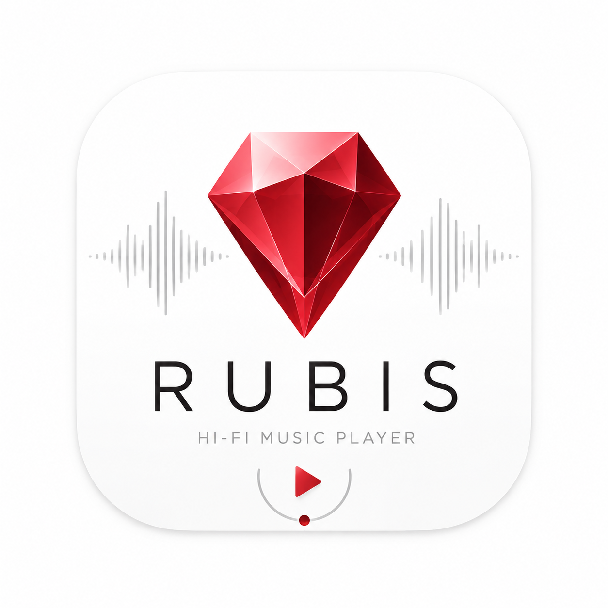

  

<h1 align="center">Rubis Music</h1>

  Hi-fi music player for macOS: bit-perfect playback, exclusive DAC access,
  gapless, DSD. This repo hosts the builds and the update feed — the source
  is private.

## Install

1. Download the latest `RubisMusic-x.y.z.dmg` from
   [Releases](https://github.com/Di-kairos/rubis-releases/releases).
2. Open the DMG and drag **Rubis Music** to Applications.
3. First launch: right-click the app → **Open** (the build is ad-hoc signed).

Requires macOS 15 or newer, Apple silicon.

## Updates

The app updates itself: it checks `appcast.xml` in this repo (Sparkle,
EdDSA-signed) about once a day and offers new versions with release notes.
"Rubis Music → Check for Updates…" checks immediately.

## Using a DAC

Plug in your USB DAC, then pin it inside the app: **Settings (⌘,) → Audio →
Output device**. Rubis takes the device exclusively while playing and switches
its sample rate to match the track — the badge in the transport bar shows the
actual rate and mode. Leave the system default output on your speakers so
system sounds stay out of the music path.
